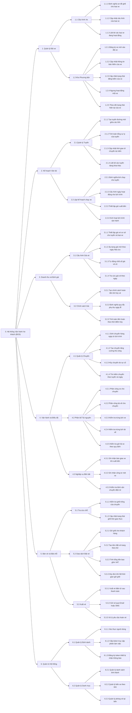

```mermaid
graph LR
    F0["0. Hệ thống Vận hành Xe khách (BOS)"]

    %% SUBJECT AREA 1
    F0 --> F1["1. Quản lý Đội xe"]
    F1 --> F11["1.1 Cấu hình Xe"]
    F11 --> F111["1.1.1 Định nghĩa sơ đồ ghế cho loại xe"]
    F11 --> F112["1.1.2 Cập nhật cấu hình của loại xe"]
    F11 --> F113["1.1.3 Liệt kê các loại xe đang hoạt động"]

    F1 --> F12["1.2 Kho Phương tiện"]
    F12 --> F121["1.2.1 Đăng ký xe mới vào đội xe"]
    F12 --> F122["1.2.2 Cập nhật thông tin bảo hiểm của xe"]
    F12 --> F123["1.2.3 Cập nhật trạng thái đăng kiểm của xe"]
    F12 --> F124["1.2.4 Ngưng hoạt động một xe"]
    F12 --> F125["1.2.5 Theo dõi trạng thái hiện tại của xe"]

    %% SUBJECT AREA 2
    F0 --> F2["2. Kế hoạch Vận tải"]
    F2 --> F21["2.1 Quản lý Tuyến"]
    F21 --> F211["2.1.1 Tạo tuyến đường mới giữa các tỉnh"]
    F21 --> F212["2.1.2 Tính toán tổng cự ly của tuyến"]
    F21 --> F213["2.1.3 Cập nhật thời gian di chuyển dự kiến"]
    F21 --> F214["2.1.4 Liệt kê các tuyến đang khai thác"]

    F2 --> F22["2.2 Lập kế hoạch chạy xe"]
    F22 --> F221["2.2.1 Định nghĩa lịch chạy cho tuyến"]
    F22 --> F222["2.2.2 Cấu hình ngày hoạt động cho lịch trình"]
    F22 --> F223["2.2.3 Thiết lập giờ xuất bến"]
    F22 --> F224["2.2.4 Kích hoạt lịch trình vận hành"]

    %% SUBJECT AREA 3
    F0 --> F3["3. Doanh thu và Định giá"]
    F3 --> F31["3.1 Cấu hình Giá vé"]
    F31 --> F311["3.1.1 Thiết lập giá vé cơ sở cho tuyến và loại xe"]
    F31 --> F312["3.1.2 Áp dụng giá mới theo ngày hiệu lực"]
    F31 --> F313["3.1.3 Tự động chốt sổ giá vé cũ"]
    F31 --> F314["3.1.4 Tra cứu giá vé theo ngày"]

    F3 --> F32["3.2 Chính sách Giá"]
    F32 --> F321["3.2.1 Tạo chính sách hoàn tiền khi hủy vé"]
    F32 --> F322["3.2.2 Định nghĩa quy tắc phụ thu ngày lễ"]
    F32 --> F323["3.2.3 Tính toán tiền hoàn theo thời điểm hủy"]

    %% SUBJECT AREA 4
    F0 --> F4["4. Vận hành và Điều độ"]
    F4 --> F41["4.1 Quản lý Chuyến"]
    F41 --> F411["4.1.1 Sinh chuyến hàng ngày từ lịch trình"]
    F41 --> F412["4.1.2 Tạo chuyến tăng cường thủ công"]
    F41 --> F413["4.1.3 Hủy chuyến do sự cố"]
    F41 --> F414["4.1.4 Tìm kiếm chuyến theo tuyến và ngày"]

    F4 --> F42["4.2 Phân bổ Tài nguyên"]
    F42 --> F421["4.2.1 Phân công xe cho chuyến"]
    F42 --> F422["4.2.2 Phân công tài xế cho chuyến"]
    F42 --> F423["4.2.3 Kiểm tra trùng lịch xe"]
    F42 --> F424["4.2.4 Kiểm tra trùng lịch tài xế"]
    F42 --> F425["4.2.5 Kiểm tra giờ lái xe theo quy định"]

    F4 --> F43["4.3 Nghiệp vụ Bến bãi"]
    F43 --> F431["4.3.1 Ghi nhận bàn giao xe khi xuất bến"]
    F43 --> F432["4.3.2 Ghi nhận công tơ mét xe"]
    F43 --> F433["4.3.3 Kiểm tra lệnh vận chuyển điện tử"]

    %% SUBJECT AREA 5
    F0 --> F5["5. Bán vé và Đặt chỗ"]
    F5 --> F51["5.1 Tra cứu chỗ"]
    F51 --> F511["5.1.1 Kiểm tra ghế trống của chuyến"]
    F51 --> F512["5.1.2 Cập nhật trạng thái ghế thời gian thực"]

    F5 --> F52["5.2 Giao dịch Đặt vé"]
    F52 --> F521["5.2.1 Giữ ghế cho khách hàng"]
    F52 --> F522["5.2.2 Tạo đơn đặt vé trạng thái chờ"]
    F52 --> F523["5.2.3 Tính tổng tiền bao gồm VAT"]
    F52 --> F524["5.2.4 Hủy đơn khi hết thời gian giữ ghế"]

    F5 --> F53["5.3 Xuất vé"]
    F53 --> F531["5.3.1 Xuất vé điện tử sau thanh toán"]
    F53 --> F532["5.3.2 Gửi vé qua Email hoặc SMS"]
    F53 --> F533["5.3.3 Xử lý yêu cầu hoàn vé"]

    %% SUBJECT AREA 6
    F0 --> F6["6. Quản trị Hệ thống"]
    F6 --> F61["6.1 Quản lý Định danh"]
    F61 --> F611["6.1.1 Xác thực người dùng"]
    F61 --> F612["6.1.2 Cấp token truy cập phiên làm việc"]
    F61 --> F613["6.1.3 Đăng ký token thiết bị nhận thông báo"]

    F6 --> F62["6.2 Quản lý Danh mục"]
    F62 --> F621["6.2.1 Quản lý danh sách tỉnh thành"]
    F62 --> F622["6.2.2 Quản lý bến xe theo tỉnh"]
    F62 --> F623["6.2.3 Quản lý phòng vé tại bến"]
```