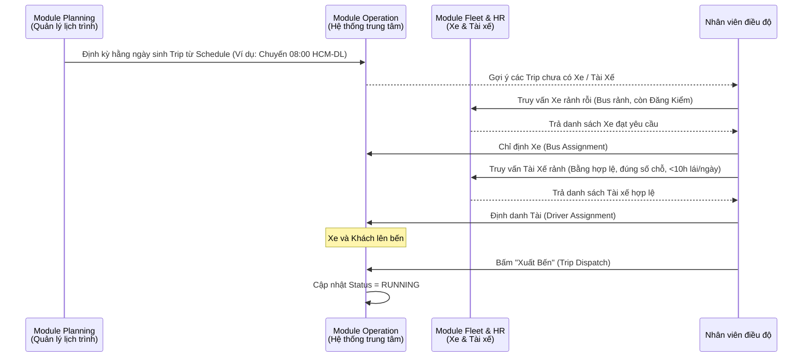
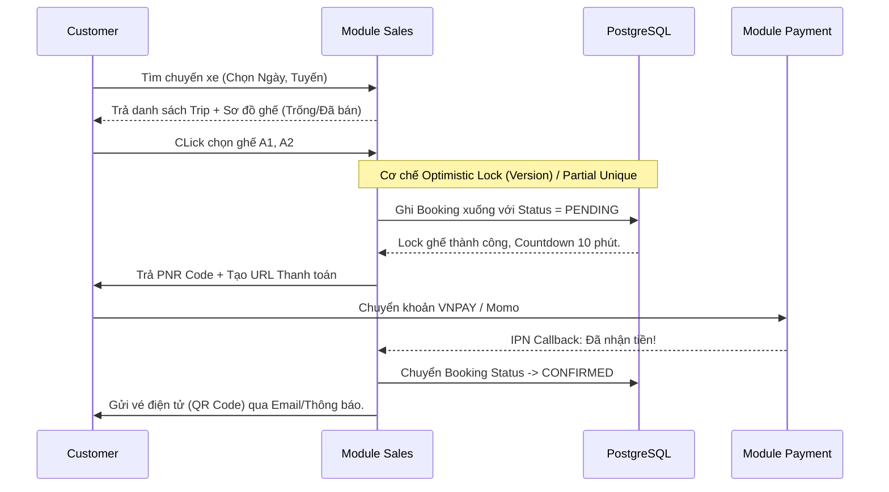
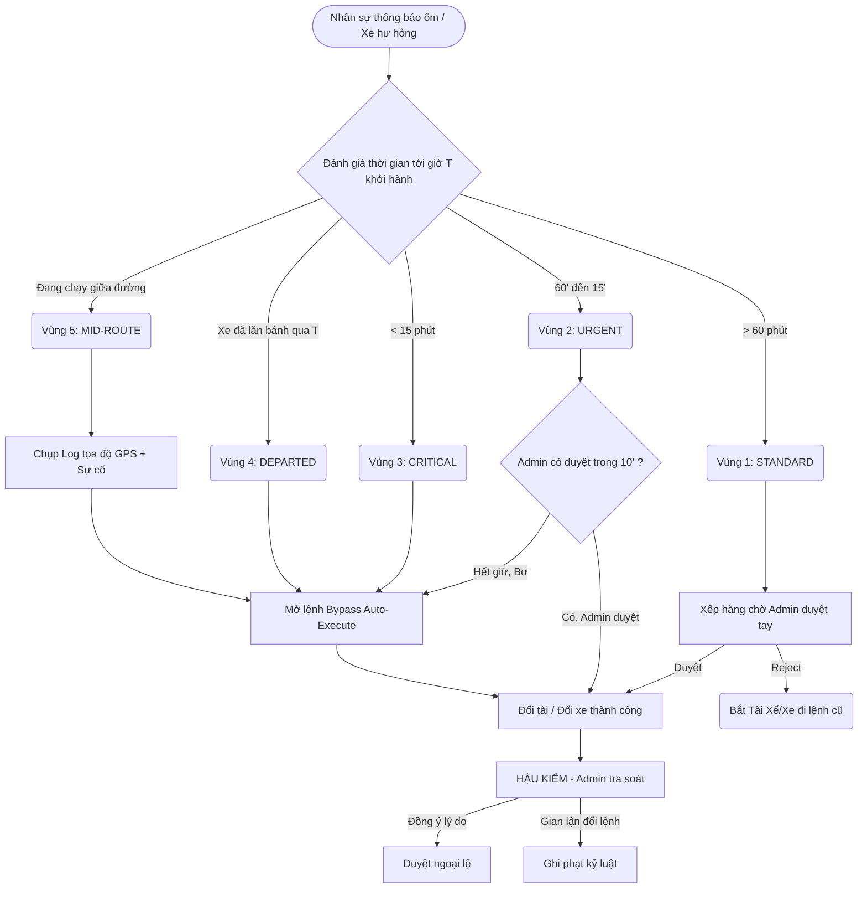

# Các Luồng Nghiệp Vụ Cốt Lõi (Business Flow Diagrams)

Tài liệu này mô hình hóa logic nghiệp vụ thông qua sơ đồ Mermaid, trực quan hóa cách các module tương tác với nhau để giải quyết một chu trình hoàn chỉnh.

## 1. Luồng Khởi Tạo & Điều Hành Chuyến (Trip Operation Flow)
Mô tả cách một chuyến xe (Trip) hiện hình từ trên giấy (Kế hoạch) tới lúc Xuất bến thực tế:

## 2. Luồng Khách Hàng Đặt Vé & Thanh Toán (Booking Sales Flow)
Hệ thống xử lý Booking đảm bảo bảo toàn dữ liệu (Concurrency Control) để hai người không mua trùng một ghế.

## 3. Luồng Thay Đổi Sự Cố Khẩn Cấp (5 Urgency Zones)
Đây là quy trình độc quyền của hệ thống. Phân tách rủi ro thời gian thành 5 Vùng và ứng dụng Bypass/Escalation:

